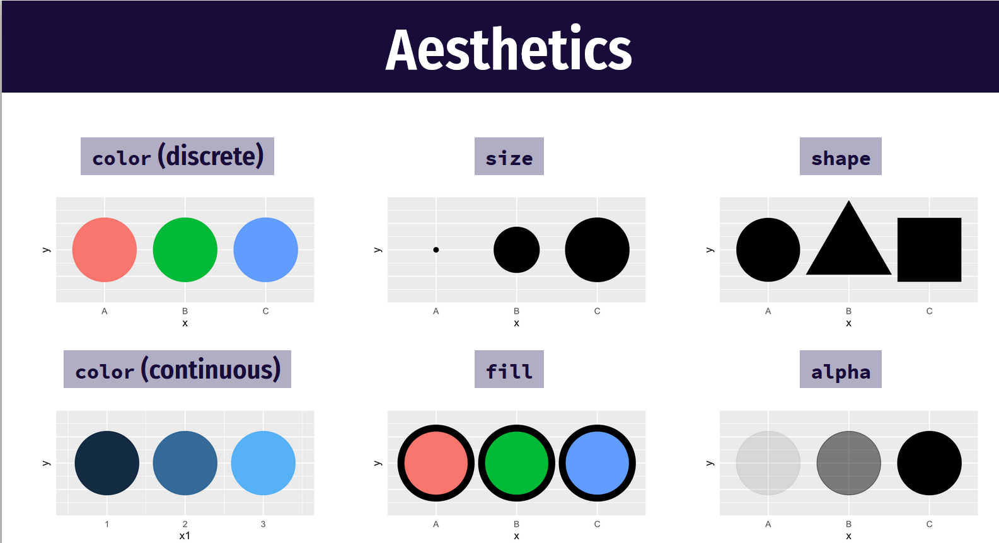

```{r setup, include=FALSE}
knitr::opts_chunk$set(echo = TRUE,
                      tidy = TRUE,
      tidy.opts=list(blank=FALSE, width.cutoff=60,size = 'tiny'),
      fig.width=10, 
      fig.height=8)
library(ggplot2)
```

## What is ggplot

- ggplot2 is an R package for producing statistical, or data, graphics.

- Under the tidyverse family of packages

- ggplot2 has an underlying grammar, based on the Grammar of Graphics

- compose graphs by combining independent components.


## How ggplot works

- ggplot2 divides plot into three different fundamental parts: 
    - Plot = data + Aesthetics + Geometry

- The principal components of every plot can be defined as follow:
    - __data__ is a data frame 
    - __Aesthetics__ is used to indicate x and y variables. It can also be used to control the color, the size or the shape of points, the height of bars, etc….. 
    - __Geometry__ defines the type of graphics (histogram, box plot, line plot, density plot, dot plot, ….)


## Install ggplot2

```{r , eval=FALSE}
# Installation
install.packages('ggplot2')
# Loading
library(ggplot2)
```


## Load the data

```{r, eval=FALSE}
setwd('where/your/work/folder/is/')
```


```{r}
library(readr)
bw_df <- read_csv('birth_weight.csv')
```


## Why?

- To have an understanding of you data we normally conduct exploratory
    data analysis (EDA) which can be graphical or numerical

 - Primarily EDA is for seeing what the data can tell us before the formal
  modelling or hypothesis testing task

- Typical graphical techniques used in EDA are:
  - Scatter plots,
  - Box plots,
  - Bar plots
  
  
## Scatter with base R

```{r, echo=TRUE}
plot(bw_df$gestwks, bw_df$bweight)
```


## Elements of grammar of graphics

- Data: variables mapped to aesthetic (aes function) features of the graph.
- Geoms: objects/shapes on the graph.
- Stats: stastical transformations that summarize data,(e.g mean, confidence intervals)
- Scales: define which aesthetic values are mapped to data values. Legends and axes display these mappings.
- Coordiante systems: define the plane on which data are mapped on the graphic.
- Faceting: splits the data into subsets to create multiple variations of the same graph (paneling).


## Aesthetic mappings and aes

 - Aesthetics are the visually perceivable components of the graph.
- Map variables to aesthetics using the aes function, such as:
    - which variables appear on the x-axis and y-axis.
    - a classification variable to colors
    - a numeric variable to the size of graphical objects
    
***


    
##  Scatter plot with ggplot2

```{r}
#declare data and x and y aesthetics, 
#but no shapes yet
ggplot(data = bw_df ) +
  geom_point(mapping=aes(x=gestwks, y=bweight))
```


***


***

```{r}
ggplot(data = bw_df) +
  geom_point(mapping = aes(x=gestwks, y=bweight , color=sex ))
```


## Boxplot


## Definition


## Lets do a Box plot?

 - A box plot of bweight vs sex
 
```{r}
ggplot(data = bw_df)
```
 


***

```{r}
ggplot(data = bw_df) +
  geom_boxplot(aes(y=bweight, x=sex, fill=sex)) + ylab("B Weight") + 
  xlab("Sex") + ggtitle("B weight vs Sex")
```


## Box plot and add scatter

```{r}
ggplot(data = bw_df) +
  geom_boxplot(aes(y=bweight, x=sex, fill=sex)) + 
  #geom_jitter(aes(y=bweight, x=sex))+
  geom_point(aes(y=bweight, x=sex))+
  ylab("B Weight") + xlab("Sex") + 
  ggtitle("B weight vs Sex") 
```


## Putting it all together
We can build a plot sequentially  
to see how each grammatical layer  
changes the appearance  

***

```{r, include=FALSE}
  #Start with data and aesthetics
ggplot(data = bw_df ,
       mapping = aes(x = gestwks,
                     y = bweight,
                     color = sex)) +
#Add a point geom
  geom_point() +
##Add a smooth geom
  #geom_smooth() +
##Make it straight
  geom_smooth(method = "lm") +
#Facet by sex
  facet_wrap(vars(sex), ncol = 1) +
## add labels
    labs(x = "Gestation weeks", y = "Birthweight",
       color = "Sex",
       title = "Lower gestation weeks leads to low birthweight",
       subtitle = "Bith weight is in grams",
       caption = "Is there something we can observe by gender") +
  #Add a theme
  theme_bw()
```


## Start with data and aesthetics

```{r}
  #Start with data and aesthetics
ggplot(data = bw_df ,
       mapping = aes(x = gestwks,
                     y = bweight,
                     color = sex))
```


## Add a point geom

```{r}
  #Start with data and aesthetics
ggplot(data = bw_df ,
       mapping = aes(x = gestwks,
                     y = bweight,
                     color = sex)) +
#Add a point geom
  geom_point()
```


## Add a smooth geom

```{r}
  #Start with data and aesthetics
ggplot(data = bw_df ,
       mapping = aes(x = gestwks,
                     y = bweight,
                     color = sex)) +
#Add a point geom
  geom_point() +
##Add a smooth geom
  geom_smooth()
```


## Make the smooth geom straight

```{r}
  #Start with data and aesthetics
ggplot(data = bw_df ,
       mapping = aes(x = gestwks,
                     y = bweight,
                     color = sex)) +
#Add a point geom
  geom_point() +
##Add a smooth geom
  #geom_smooth() +
##Make it straight
  geom_smooth(method = "lm")
```


## Facet by sex


```{r}
  #Start with data and aesthetics
ggplot(data = bw_df ,
       mapping = aes(x = gestwks,
                     y = bweight,
                     color = sex)) +
#Add a point geom
  geom_point() +
##Add a smooth geom
  #geom_smooth() +
##Make it straight
  geom_smooth(method = "lm") +
#Facet by sex
  facet_wrap(vars(sex), ncol = 1)
```

## add labels

```{r}

  #Start with data and aesthetics
ggplot(data = bw_df ,
       mapping = aes(x = gestwks,
                     y = bweight,
                     color = sex)) +
#Add a point geom
  geom_point() +
##Add a smooth geom
  #geom_smooth() +
##Make it straight
  geom_smooth(method = "lm") +
#Facet by sex
  facet_wrap(vars(sex), ncol = 1) +
## add labels
    labs(x = "Gestation weeks", y = "Birthweight",
       color = "Sex",
       title = "Lower gestation weeks leads to low birthweight",
       subtitle = "Bith weight is in grams",
       caption = "Is there something we can observe by gender")

```


## Themes 

https://ggplot2.tidyverse.org/reference/ggtheme.html

***

```{r}
  #Start with data and aesthetics
ggplot(data = bw_df ,
       mapping = aes(x = gestwks,
                     y = bweight,
                     color = sex)) +
#Add a point geom
  geom_point() +
##Add a smooth geom
  #geom_smooth() +
##Make it straight
  geom_smooth(method = "lm") +
#Facet by sex
  facet_wrap(vars(sex), ncol = 1) +
## add labels
    labs(x = "Gestation weeks", y = "Birthweight",
       color = "Sex",
       title = "Lower gestation weeks leads to low birthweight",
       subtitle = "Bith weight is in grams",
       caption = "Is there something we can observe by gender") +
  #Add a theme
  theme_bw()
```

